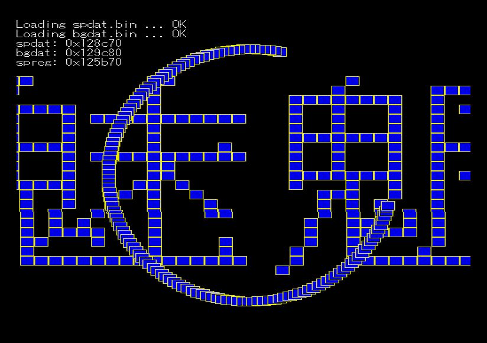

# MicroPython guru

X68000 マシン語プログラミングのスプライト操作サンプル (Oh!X 1992 年 8 月号) を、 [MicroPython for X680x0](https://github.com/yunkya2/micropython-x68k/blob/port-x68k/ports/x68k/README.md) に移植したものです。

Python の練習のために作ったものです。慣れていないのでヘボいコードになっていると思います。ツッコミは歓迎します。



## 使い方

```sh
micropython gendat.py # データファイルが 2 つ作られる
micropython guru.py
```

### コマンドラインオプション

-   `--no-asm-int` : 描画処理でインラインアセンブラを使わない (激重)
-   `--no-asm-move` : 移動処理でインラインアセンブラを使わない (激重)
-   `--sp=N` : スプライトの数を N 個にする (1 ～ 128)
-   `--invert-bg` : BG を反転する

## メモ

-   10MHz で画面がちらつく。 16MHz でも描画が間に合っていない模様 ~~。割り込みを使わなければ間に合うかもしれない~~
-   インラインアセンブラのコードが甘い (今のところ、チューニングしても焼け石に水か)
